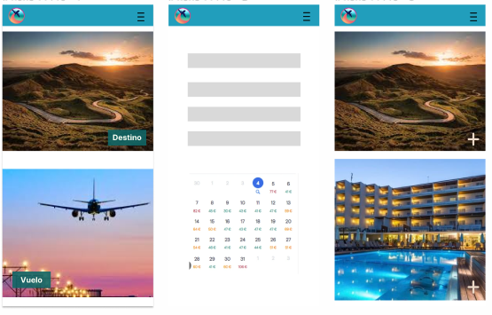
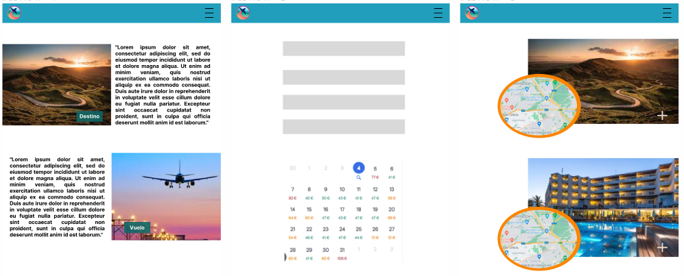
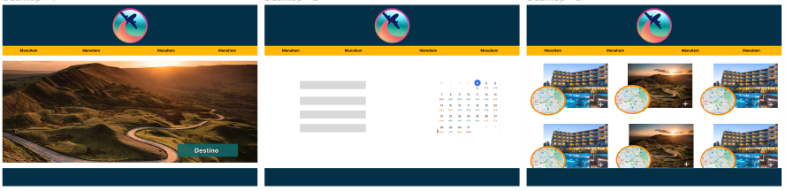

Travel Website
This project is a single-page website created using the React framework that showcases different vacation destinations and allows users to book flights.

Design
The design was made with figma if you want to see visit the url
https://www.figma.com/file/jS9mI8IQAjCc2FBpdaNnYS/Untitled?type=design&node-id=0%3A1&t=15F4a2HR4tgEK3MJ-1

Available Pages
The website features four different pages:

Home: The landing page that displays a slideshow of two images that redirect users to the Explore and Reserve pages.
Explore: The page that displays different vacation destinations and detailed information about each one. It accesses the hotel service, which contains a JSON file with information about hotels.
Reserve: The form used to book flights.
HotelInfo: The page that will contain information about the selected hotel (currently unavailable).
Components
The pages are composed of different components, including:

Header: The component that includes the logo and the Navbar.
Navbar: The component that contains the list of links to navigate through the website.
ImgList: The component that displays two images on the landing page.
Footer: The component that includes personal information and social media links.
ShowMap: The component that displays the location of the hotels. It accesses the hotel service, which contains a JSON file with information about hotels.
Form: The component used to book flights.
Technologies Used
The project utilizes the following technologies:

React: The framework used to create the website.
Leaflet: The JavaScript library used for interactive maps.
https://leafletjs.com/
Ionicons: The icon library used for web applications.
https://ionic.io/ionicons
Services Used
img: The service that contains a JSON file with the images used on the landing page.
hotel: The service that contains a JSON file with information about hotels.
Running the Project
To run the project on your computer, follow these steps:

Clone the repository on your computer using the command git clone https://github.com/AishaYanez/WebReact.git.
Access the project directory using the command cd repository-name in this case WebReact.
Install the project dependencies using the command npm install.
Run the project in development mode using the command npm start.
The website will be available in your browser at http://localhost:3000.

Author
This project was created by me, Aisha Yanez de la Guardia. If you have any questions, you can contact me at https://github.com/AishaYanez/WebReact.